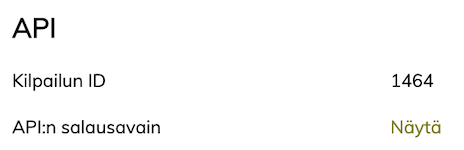

# Hirviurheilu API

Hirviurheilu API is a JSON REST API.

## Environments

* test: [https://testi.hirviurheilu.com](https://testi.hirviurheilu.com)
* production: [https://www.hirviurheilu.com](https://www.hirviurheilu.com)

## Public API

The `race_id` used in the API paths can be found e.g. from the race page URL. For example [https://www.hirviurheilu.com/races/2075](https://www.hirviurheilu.com/races/2075) has the `race_id` 2075.

### Race and competitors with start time

`GET /api/v2/public/races/:race_id`

Example call with [cUrl](https://curl.haxx.se/):

`curl -X GET https://www.hirviurheilu.com/api/v2/public/races/2075`

### Competitors' times

`GET /api/v2/public/races/:race_id/times`

## Official API

### Headers

* `Authorization: <race API secret>`
* `Content-Type: application/json`

The race API secret can be found from the official race basic information form:



### Validate API secret

`GET /api/v2/official/races/:race_id/health`

If you have sent the correct `Authorization` header matching the `race_id`, the API returns 200 and the race name in the response body. If the authentication fails, it returns 401.

### Saving times

* `PUT /api/v2/official/races/:race_id/competitors/:competitor_number/start_time`
* `PUT /api/v2/official/races/:race_id/competitors/:competitor_number/shooting_start_time`
* `PUT /api/v2/official/races/:race_id/competitors/:competitor_number/shooting_finish_time`
* `PUT /api/v2/official/races/:race_id/competitors/:competitor_number/arrival_time`

The `competitor_number` is the same number that the competitors have in the public APIs.

All of these require a JSON request body like this:

```
{ "ms_since_midnight": 43854000 }
```

The example value means time 12:10:54.

`1000 * (60*60*12 + 60*10 + 54) = 43854000`

Notice that the time should take into account the race start time. For example if the race has been defined to start at 10:00, you cannot save a time that is before that.

When the request succeeds, it returns 200 with a response body like:

```
{
  "real_time": "12:10:54",
  "relative_time": "02:10:54" // assuming the race starts at 10:00
}
```

### Saving single shot

* `PUT /api/v2/official/races/:race_id/competitors/:competitor_number/shots/:shot_number`
* `PUT /api/v2/official/races/:race_id/competitors/:competitor_number/extra_shots/:shot_number`

The `competitor_number` is the same number that the competitors have in the public APIs. The `shot_number` is the order number of the shot starting from 1 (not 0-based).

Both of these require a JSON request body like this:

```
{ "value": 10 }
```

The value 11 can be used to indicate inner ten in the Ilmaluodikko races.

When the request succeeds, it returns 200 with a response body containing all the saved shots:

```
{ "shots": [9, 8, 7, 10] }
```

### Saving multiple shots

You can also save multiple shots with one request using the following APIs:

* `PUT /api/v2/official/races/:race_id/competitors/:competitor_number/shots`
* `PUT /api/v2/official/races/:race_id/competitors/:competitor_number/extra_shots`

Both of these require a JSON request body like this:

```
{ "shots": [10, 8, 8, 9, 10] }
```

The value 11 can be used to indicate inner ten in the Ilmaluodikko races.

When the request succeeds, it returns 200 with a response body containing all the saved shots:

```
{ "shots": [10, 8, 8, 9, 10] }
```

If you call the API twice for the same competitor, the existing shots will be replaced with new ones.
